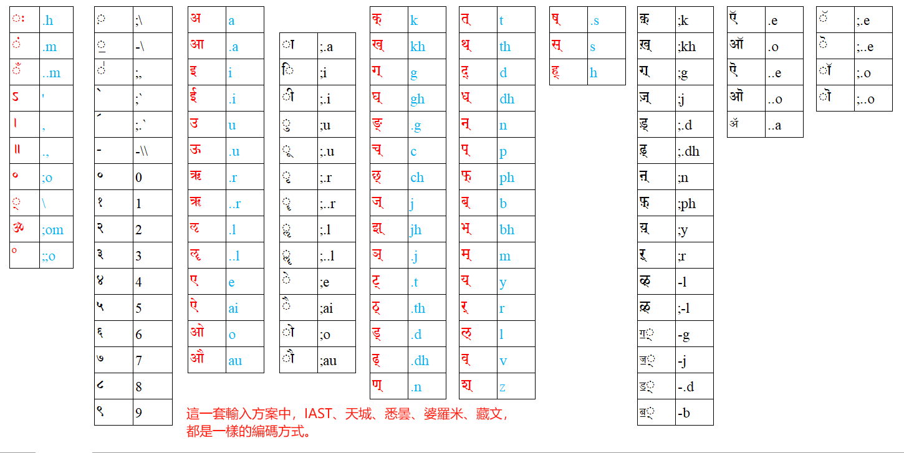

# **Rime小狼毫輸入法安裝與使用**

https://docs.qq.com/doc/DQW1nbmZZTEFNQVNx

# **rime梵藏輸入方案**

**天城體** devanagari

https://github.com/arpcn/rime-devanagari/

**IAST**

https://github.com/arpcn/rime-iast

**悉曇體**及**婆羅米** Siddham & Brahmi

https://github.com/arpcn/rime-siddham

**藏文**

https://github.com/arpcn/rime-tibetan

# **鍵盤分布**

這一套輸入方案中，IAST、天城、悉曇、婆羅米、藏文，都是[**一樣的編碼方式**](#)。

查看 ☞ <b><a href="">表格文本</a></b> ☜ 點擊 ◂ 

|क्|k|त्|t|श्|z|अ|a|||़|;\ |क़्|;k|ऍ|.e|
|-|-|-|-|-|-|-|-|-|-|-|-|-|-|-|-|
|ख्|kh|थ्|th|ष्|.s|आ|.a|ा|;.a|॒|-\ |ख़्|;kh|ऑ|.o|
|ग्|g|द्|d|स्|s|इ|i|ि|;i|॑|;,|ग़्|;g|ऎ|..e|
|घ्|gh|ध्|dh|ह्|h|ई|.i|ी|;.i|  ॓|;`|ज़्|;j|ऒ|..o|
|ङ्|.g|न्|n|ः|.h|उ|u|ु|;u|  ॔|;.`|ड़्|;.d|ॲ|..a|
|च्|c|प्|p|ं|.m|ऊ|.u|ू|;.u|-|-\\\ |ढ़्|;.dh|ॅ|;.e|
|छ्|ch|फ्|ph|ँ|..m|ऋ|.r|ृ|;.r|०|0|ऩ्|;n|ॆ|;..e|
|ज्|j|ब्|b|ऽ|'|ॠ|..r|ॄ|;..r|१|1|फ़्|;ph|ॉ|;.o|
|झ्|jh|भ्|bh|।|,|ऌ|.l|ॢ|;.l|२|2|य़्|;y|ॊ|;..o|
|ञ्|.j|म्|m|॥|.,|ॡ|..l|ॣ|;..l|३|3|ऱ्|;r|||
|ट्|.t|||॰|;o|ए|e|े|;e|४|4|ळ्|-l|||
|ठ्|.th|य्|y|्|\\ |ऐ|ai|ै|;ai|५|5|ऴ्|;-l|||
|ड्|.d|र्|r|º|;;o|ओ|o|ो|;o|६|6|ॻ्|-g|||
|ढ्|.dh|ल्|l|||औ|au|ौ|;au|७|7|ॼ्|-j|||
|ण्|.n|व्|v|||ॐ|;om|||८|8|ॾ्|-.d|||
|||||||||||९|9|ॿ्|-b|||

